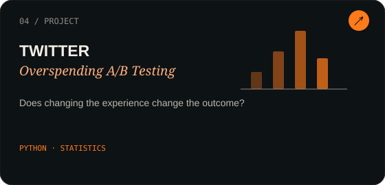

<div align="center">


<br>

# CHARU TRISHOOLA

### economics → numbers → questions → rabbit holes

<br>

`MUMBAI / INDIA` &nbsp;·&nbsp; `DATA ANALYST` &nbsp;·&nbsp; `ALWAYS CURIOUS`

<br><br>

</div>

---

<div align="center">


</div>

<br>

## a little about me

I'm Charu Trishoola Mohan Udaiyar.

I studied Economics, and that really piqued my interest in numbers and data.  
Along the way, figuring things out became fun!

A dataset with no clear-cut answer to the question, and a few rabbit holes that begin with  
*"let me just check one thing"* — that's usually where I end up.

<br>

<div align="center">


</div>

<br>

I like the part where **numbers meet people**.

The numbers tell me *what is happening*.  
Economics makes me ask *why*.  
And data gives me a way to investigate it.

So I tend to move between statistics, business questions, behaviour and the occasional completely unnecessary rabbit hole.

---

<div align="center">

`OBSERVATION_01`  
`THE QUESTION IS USUALLY MORE INTERESTING THAN THE ANSWER.`

</div>

<br>

---

# things I've figured out so far

Not everything here started with a perfectly formed question.

Some started with a dataset.  
Some started with an assignment.  
Some started with *"hmm... what happens if I check this?"*

<br>

<div align="center">

### ◉ ZOMATO


**Spreadsheet Analysis · Excel · Data Cleaning · Business Analysis**

Explored restaurant data to understand pricing, cuisines, locations and possible expansion opportunities.

**[view project →](https://github.com/trishoolamohan2311-creator/Zomato_Spreadsheet_Analysis)**

<br><br>

### ◉ COLUMBIA ASIA HOSPITAL


**SQL · Power BI · DAX · Power Query**

Looked at patients, departments, waiting time, revenue and satisfaction to turn hospital data into something a little easier to understand.

**[view project →](https://github.com/trishoolamohan2311-creator/columbia-asia-hospital-analytics)**

<br><br>

### ◉ SOCIAL MEDIA


**SQL · Engagement · User Behaviour · Data Quality**

A closer look at how users interact, where engagement comes from, and what the data can actually tell us.

**[view project →](https://github.com/trishoolamohan2311-creator/social-media-analysis-project)**

</div>

<br>

---

<div align="center">


<br><br>

### one more rabbit hole ↓

</div>

<br>

<div align="center">



</div>

### Linear Regression & Gradient Descent

A small dive into the mechanics behind prediction — from drawing a line through data to understanding how a model actually learns.

**Python · Statistics · Machine Learning**

This one made me appreciate something I keep running into:

> Sometimes understanding *how* something works is more interesting than simply getting the answer.

---

# the toolbox

<div align="center">

### `I USE THESE TO ASK BETTER QUESTIONS`

<br>

| | |
|---|---|
| 📊 **Analysis** | Excel · SQL · Statistics |
| 📈 **Visualisation** | Power BI · DAX |
| 🐍 **Code** | Python · Pandas · Matplotlib |
| 🤖 **Learning** | Machine Learning · Experimentation |
| 🧠 **Background** | Economics · Data · Business |

</div>

<br>

---

<div align="center">


</div>

<br>

# things that keep me curious

Why do people behave differently when the numbers change?

Why does one metric look perfectly fine until you split it by something else?

Why does a dataset always seem to have **one more weird thing** hiding in it?

And why does *"I'll just check one thing"* almost never mean one thing?

<br>

<div align="center">

`STATISTICS` &nbsp; ✦ &nbsp; `BEHAVIOUR` &nbsp; ✦ &nbsp; `ECONOMICS` &nbsp; ✦ &nbsp; `DATA`

</div>

---

<br>

<div align="center">

### a thought I keep coming back to

<br>

*"We endeavour to examine our own conduct as we imagine any other fair and impartial spectator would examine it."*

<br>

**— Adam Smith, _The Theory of Moral Sentiments_**

<br>

</div>

<br>

For me, that's an interesting way of thinking about data too.

Step outside the first explanation.  
Look again.  
Question the obvious.

---

<div align="center">


</div>

<br>

# currently exploring

```text
machine learning
        ↓
experimentation
        ↓
statistics
        ↓
human behaviour
        ↓
business questions
        ↓
"wait... why?"

I'm still learning, still building, and still finding new things to investigate.

Which is probably the whole point.

<br>
<div align="center">
if you found your way here...

You can find my work on
GitHub

or say hello at
Email

<br><br>

THE UNIVERSE IS STILL EXPANDING.

<br>

🐈

<br>

<sub>probably investigating something completely unrelated.</sub>

</div> ```
